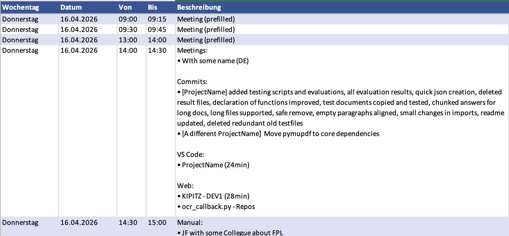

# WorkLogger

A lightweight macOS menu-bar app that silently tracks your work activity and generates weekly Excel timesheets — enriched with git commits, meetings, and browser tabs.



## Install

```sh
# Prerequisites
xcode-select --install
pip3 install openpyxl

# Build & install
git clone https://github.com/Ralo93/tracker.git WorkLogger
cd WorkLogger
make app
```

On first launch grant **Accessibility**, **Screen Recording**, and **Safari Automation**, then relaunch.

## Features

- Automatic app & window tracking (VS Code project detection, Safari tabs & URLs)
- Teams meeting detection (`Kompakte Besprechungsansicht`)
- Git commit aggregation from configured repositories
- Idle / screen-lock / sleep detection for accurate work-time boundaries
- Quick manual entry from any app
- Weekly `.xlsx` report with grouped bullet-point descriptions
- Prefilled meeting slots (immovable tier-0 rows)
- Configurable noise filters, block grid, retention, and Safari privacy controls
- 113 automated tests gate every build

## Shortcuts

| Shortcut | Action |
|----------|--------|
| `Cmd+Shift+L` | Quick manual log entry (from any app) |
| `Cmd+E` | Export weekly report (.xlsx) |
| `Cmd+,` | Preferences |
| `Cmd+Q` | Quit |

## Example Logs

Each day produces a `YYYY-MM-DD.jsonl` file:

```jsonl
{"app":"Code","bundle_id":"com.microsoft.VSCode","detail":"WorkLogger","event":"app_switch","timestamp":"2026-04-15T09:33:51"}
{"detail":"GPT4Gov-Converter-App","event":"vscode_project_change","timestamp":"2026-04-15T09:34:07"}
{"app":"Safari","bundle_id":"com.apple.Safari","detail":"GitHub","event":"app_switch","timestamp":"2026-04-15T09:35:10","url":"https://github.com"}
{"event":"idle_start","idle_seconds":300,"timestamp":"2026-04-15T09:40:10"}
{"event":"idle_end","idle_duration_seconds":847,"timestamp":"2026-04-15T09:54:17"}
{"event":"screen_lock","timestamp":"2026-04-15T12:00:00"}
{"event":"screen_unlock","timestamp":"2026-04-15T13:00:00"}
{"description":"Sprint Planning Prep","duration_minutes":60,"event":"manual_entry","time":"17:45","timestamp":"2026-04-15T17:45:33"}
```

## Report Output

The exported `.xlsx` groups activity per time block with bullet-pointed descriptions:

```
Meetings:
• Florentin Rauscher
• Sven Metscher

Commits:
• [WorkLogger] fix config, add tests, refactor report
• [GPT4Gov] update pipeline

VS Code:
• WorkLogger (57min)
• GPT4Gov-Converter-App (23min)

Apps:
• Microsoft Teams (10min)

Web:
• Azure DevOps (12min)
• GitHub (5min)
```


